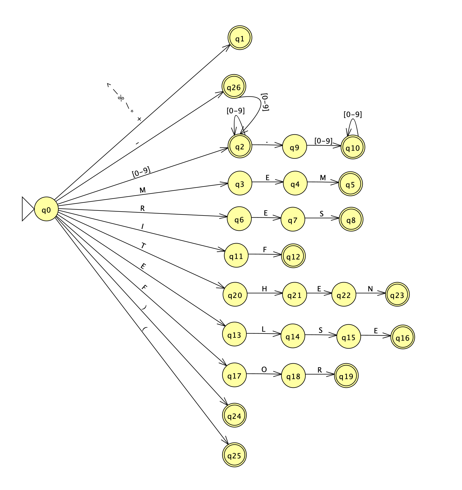

# Analisador Léxico

Linguagens Formais e Compiladores

Este projeto é um **analisador léxico** implementado em Python, baseado em uma **Máquina de Estados Finitos Determinística (MEFD)**. Ele processa linhas de código e converte lexemas em tokens válidos da linguagem definida.

  
*MEFD elaborada para encontrar os lexemas da linguagem*  
Utilizado o software [JFALP](https://www.jflap.org/) para desenvolver essa visualização

---

## Visão Geral

O lexer percorre a entrada caractere por caractere e gera uma lista de **tokens** com tipo, valor e posição. Ele reconhece:

* Parênteses: `(` e `)`
* Números inteiros e reais (inclusive negativos): `-10`, `2.5`
* Operadores: `+ - * / % ^ |`
* Palavras-chave: `MEM`, `RES`, `IF`, `THEN`, `ELSE`, `FOR`
* Erros léxicos são capturados e registrados como tokens do tipo `ERROR`, com mensagens descritivas e indicação de coluna

---

## Estrutura do Projeto

```text
├── Lexer.py            # Lógica do analisador léxico (MEFD)
├── Token.py            # Estrutura do token
├── TokenType.py        # Enumeração de tipos de token
├── main.py             # Interface de execução
├── mefd.png            # Diagrama da máquina de estados
├── tests/              # Arquivos de teste
│   ├── test1.txt       # Arquivo de testes
│   ├── test2.txt       # Arquivo de testes
│   └── test3.txt       # Arquivo de testes
└── tokens_output.json  # Saída dos tokens (gerado automaticamente)
```

---

## Como Executar

### 1. Pré-requisitos

* Python 3.8+
* Ambiente virtual (recomendado)

### 2. Instalação

```bash
# Crie um ambiente virtual (opcional, mas recomendado)
python -m venv .venv
source .venv/bin/activate  # Linux/Mac
.venv\Scripts\activate     # Windows
```

### 3. Utilização

O script `main.py` oferece duas saídas:

* **Formatada** (padrão): exibe tokens em tabela e erros com apontador
* **Raw** (`--raw` ou `-r`): imprime cada token em uma linha simples, seguido de linha em branco

```bash
# Saída formatada e salva JSON
python main.py --file tests/test1.txt --save
python main.py --file tests/test1.txt -s

# Saída raw (apenas tokens), sem JSON
python main.py --file tests/test1.txt --raw
python main.py --file tests/test1.txt -r

# Saída raw e salva JSON
python main.py --file tests/test1.txt --save-json --raw
python main.py --file tests/test1.txt -s -r
```

**Flags disponíveis:**

* `-s`, `--save-json`   : Salva saída estruturada em JSON (`tokens_output.json` por padrão)
* `-r`, `--raw`         : Imprime somente tokens, um por linha, com espaçamento de linha entre entradas
* `--output <caminho>`   : Define arquivo de saída JSON

### Saída JSON de exemplo

```json
[
  {
    "line": 0,
    "tokens": [
      { "value": "(",   "token_class": "LEFT_PARENTHESIS",  "row": 0, "column": 0 },
      { "value": "1",   "token_class": "INTEGER_NUMBER",    "row": 0, "column": 1 },
      { "value": "2",   "token_class": "INTEGER_NUMBER",    "row": 0, "column": 3 },
      { "value": "&",   "token_class": "ERROR",            "row": 0, "column": 5 }
    ],
    "error": "Invalid character: '&'",
    "error_position": 5
  },
  {
    "line": 1,
    "tokens": [
      { "value": "(",   "token_class": "LEFT_PARENTHESIS",  "row": 1, "column": 0 },
      { "value": "3",   "token_class": "INTEGER_NUMBER",    "row": 1, "column": 1 },
      { "value": "4",   "token_class": "INTEGER_NUMBER",    "row": 1, "column": 3 },
      { "value": "-",   "token_class": "OPERATOR",         "row": 1, "column": 5 },
      { "value": ")",   "token_class": "RIGHT_PARENTHESIS", "row": 1, "column": 6 }
    ]
  }
]
```

---

## Implementação baseada em MEFD

Cada tipo de token é reconhecido por uma sequência de estados da máquina MEFD (representada em `mefd.png`). A lógica do autômato está refletida nas funções do `Lexer`, como:

* `number()`: trata estados de número inteiro e real
* `keyword()`: transições para reconhecer palavras-chave
* Chamadas a `current_char()` e `advance()` simulam os arcos do autômato

---

## 👨‍💻 Autor

**André Fabricio Wozniack**
